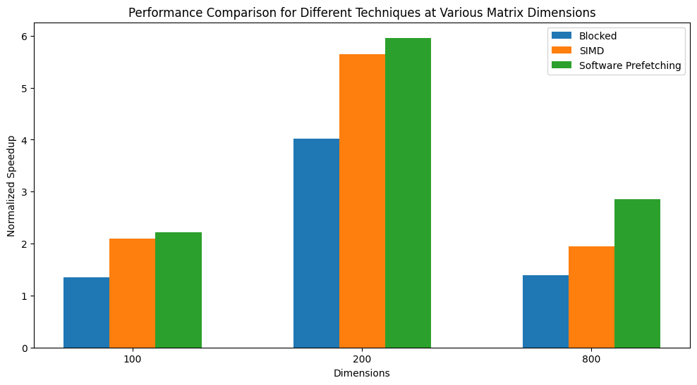

# PA1-The-Matrix

Perform matrix multiplication using various optimization techniques:
- blocked matrix multiplication
- SIMD instructions
- software prefetching

and combination of these techniques.

 

> **Note:** The code for all the tasks is separated into their respective branches.

---
## Task 1: Blocked Matrix Multiplication

In this task, we do of blocked matrix multiplication, a technique designed to optimize matrix computations by enhancing cache efficiency. By dividing large matrices into smaller blocks and strategically performing multiplication and accumulation operations, we aim to minimize cache misses and improve overall performance.

Matrix Partitioning: To begin, we divide the input matrices A, B, and C into smaller blocks. Each block size is carefully chosen to fit comfortably within the CPU cache, ensuring that most of the necessary data remains in cache during computations.

Blocked Multiplication: Within each block, we perform matrix multiplication using conventional methods. However, due to the reduced block size, the cache can hold a substantial portion of the required data, significantly reducing memory access latency.

Accumulation: As we calculate the products of individual blocks, we accumulate the results in the corresponding positions of the output matrix C. This process continues for all blocks, effectively computing the final result.

The benefits of blocked matrix multiplication become increasingly evident as matrix sizes grow. 

For a matrix size of 100, it achieves a normalized speedup of 1.35 on an average.

For a matrix size of 200, it achieves a normalized speedup of 2.1 on an average.

For a matrix size of 800, it achieves a normalized speedup of 2.22 on an average.

---
## Task 2: SIMD instructions

In this task, we leverage Single Instruction, Multiple Data (SIMD) instructions to enhance the efficiency of matrix multiplication. To optimize the computation further, we adopt a kij loop iteration approach, capitalizing on spatial locality advantages when dealing with row-major matrices. Our primary focus is on using AVX256 SIMD registers, capable of holding four double-precision values simultaneously, to vectorize the multiplication operations efficiently.

Data Vectorization: We access and load four instances of matrix A[i,k] into a 256-bit SIMD register, where i represents the row index and k is the column index. This step allows us to perform four double-precision multiplications in parallel.

Matrix Multiplication: As we iterate over j (column index), we multiply each instance of A[i,k] with B[i,j], exploiting the full power of SIMD instructions to execute four double multiplications simultaneously. The results are stored in the target matrix C[i,j].

For a matrix size of 100, it achieves a normalized speedup of 4.02 on an average.

For a matrix size of 200, it achieves a normalized speedup of 5.65 on an average.

For a matrix size of 800, it achieves a normalized speedup of 5.96 on an average.

Using SIMD instructions significantly accelerates matrix multiplication, providing substantial performance gains, especially for larger matrices. This optimization technique plays a crucial role in enhancing the overall efficiency of numerical computations.

---
## Task 3: Software Prefetching

Technique:
There are two parts here (i) Locality Analysis and (ii) Scheduling of Prefetch. Using Locality analysis we determine which block is to be prefetched and scheduling deals with when are these prefetch requests issued.

Locality Analysis: For accesses with spatial locality we prefetch after 8 access ( as there are 8 doubles in a Cache line) & for temporal locality we need to access once before the loop starts.

Scheduling: First we peel off some initial loop and just perform prefetching this is done to make sure that the block prefetched as already reached the cache. After that we can unroll the loop (by the after of 8 as there are 8 double in a cahe line). This is done to make sure that misses are isolated add we only prefetch static memory accesses.

Observation:
Prefetching performs well only in the case of Large matrices and consistently provides a 2+ speedup over normal matrix multiplication

Limitations:
Some limitations of this technique are : (i) bad performance with small matrix (ii) Huge software sophistication & overhead

For a matrix size of 100, it achieves a normalized speedup of 1.39 on an average.

For a matrix size of 200, it achieves a normalized speedup of 1.95 on an average.

For a matrix size of 800, it achieves a normalized speedup of 2.85 on an average.

---
## Bonus Task 1: Blocked Matrix Multiplication + SIMD instructions

In this bonus task, we explore two optimization techniques: blocked matrix multiplication and SIMD (Single Instruction, Multiple Data) instructions. By combining these strategies, we aim to further enhance the efficiency of matrix multiplication and unlock performance gains, especially for specific matrix sizes.

Approach:

Blocked Matrix Multiplication: We begin by partitioning the input matrices A, B, and C into smaller, more manageable blocks. The block size, carefully chosen, ensures that most of the data fits within the CPU cache, minimizing memory access latencies.

SIMD Vectorization: Within each block, we leverage the power of SIMD instructions to perform vectorized operations. SIMD registers, capable of processing multiple data elements simultaneously, allow us to parallelize the multiplication and accumulation steps effectively.

Optimal Block Size: It's essential to note that the choice of block size plays a crucial role in this approach. We find that this technique delivers the most significant speedup when the block size and matrix dimensions are multiples of 2, indicating a nuanced understanding of hardware architecture.

For a matrix size of 100, it achieves a normalized speedup of 1.73 on an average.

For a matrix size of 200, it achieves a normalized speedup of 2.46 on an average.

For a matrix size of 800, it achieves a normalized speedup of 2.37 on an average.

---
## Bonus Task 2: Blocked Matrix Multiplication + Software Prefetching

The algorithm prefetching the future row of blocks of A and column of blocks of B with future C(ib,jb) block. The term "future" depends on variable Prefetch_jump_x where x is i,j or k, which sets the number of rows/column that you want to prefetch. As the it will have an optimal value for each i,j and k (dependent on each other). This is because if you have small value fo Prefetch_jump_x then when you want that data it might still be under the process of fetching, and if it is too big then you might just end up polluting the cache and the prefetche data would be gone by the time it is needed.

I am getting better results as I am increasing the size of the matrix. For 100 and 200 the speedup is not much. But in 800 and higher sized matrices it goes from 1.5 to 2.2 with some spikes touching 3.

For a matrix size of 100, it achieves a normalized speedup of 1.36 on an average.

For a matrix size of 200, it achieves a normalized speedup of 1.93 on an average.

For a matrix size of 800, it achieves a normalized speedup of 2.15 on an average.

---
## Bonus Task 3: SIMD instructions + Software Prefetching

In this bonus task, we combine two powerful optimization techniques, SIMD (Single Instruction, Multiple Data) instructions and software prefetching, to further boost the efficiency of matrix multiplication. Our goal is to harness the strengths of both methods to achieve remarkable speedups in computation.

Approach:

SIMD Vectorization: To exploit the potential of SIMD instructions, we employ vectorized operations on the matrices. By utilizing SIMD registers, which can process multiple data elements simultaneously, we achieve significant parallelism. In this case, we use a lookahead distance of 40, allowing us to operate on a substantial chunk of data at once.

Software Prefetching: Concurrently, we implement software prefetching to anticipate and preload data from memory into cache before it's required. This technique involves careful analysis of memory access patterns and scheduling prefetch requests optimally.

Combining Forces: By integrating SIMD vectorization with software prefetching, we aim to maximize data utilization and computation efficiency. The lookahead distance of 40 ensures that data is preloaded well in advance, aligning with SIMD processing requirements.

For a matrix size of 100, it achieves a normalized speedup of 3.81 on an average.

For a matrix size of 200, it achieves a normalized speedup of 6.38 on an average.

For a matrix size of 800, it achieves a normalized speedup of 4.86 on an average.

---
The speedup plot for each dimension is as follows-

